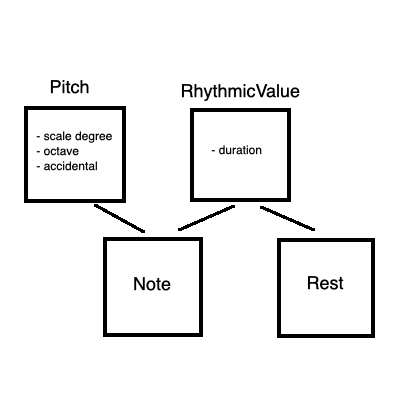
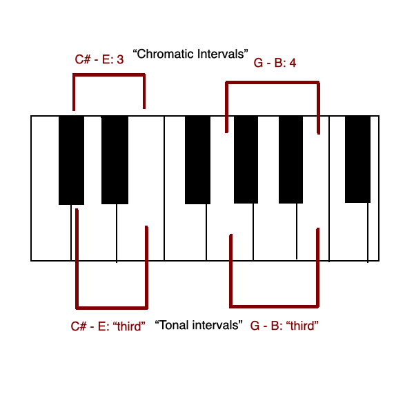
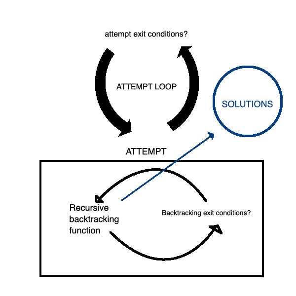
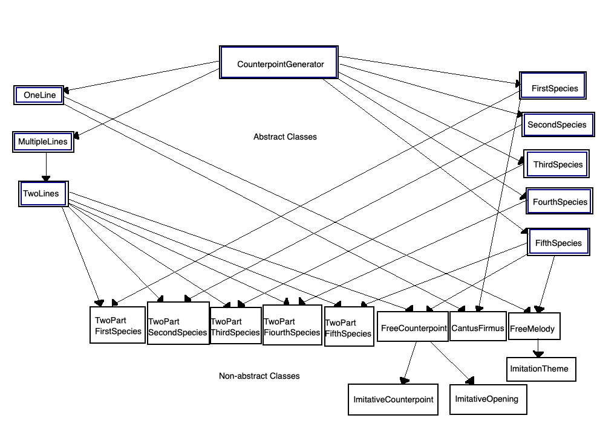

# Counterpoint Generator

View the live project [here.](https://zalmankelber.github.io/Counterpoint-frontend)

Watch a quick video demo and explanation [here.](https://www.youtube.com/watch?v=WRb-gmUWNR0&feature=youtu.be)

Read more about this project in [this Medium post](https://alexkelber.medium.com/using-a-backtracking-algorithm-to-generate-two-part-imitative-polyphony-in-the-style-of-palestrina-41dac93023b0)

This repository contains the files for the React frontend of the project, which is hosted on **GitHub Pages.** The API is hosted on **Heroku** and can be found at [this repository.](https://github.com/ZalmanKelber/Counterpoint-server)

An earlier version of the API can be seen at [this repository.](https://github.com/ZalmanKelber/Counterpoint)

## Basic Description 

**Tl;dr:** This program uses a backtracking algorithm to compose short musical compositions in the strict and complex style of 16th century vocal polyphony

----

The sacred vocal music of late Renaissance Italy, which reached its apex with the works of [Giovanni Pierluigi da Palestrina](https://en.wikipedia.org/wiki/Giovanni_Pierluigi_da_Palestrina), is unparalleled in history for its unique combination of complexity and extreme strictness of style.  It led to a pedagogical system known as [Species Counterpoint](https://en.wikipedia.org/wiki/Counterpoint), that involves a succession of increasingly difficult and complicated compositional exercises that has, in the centuries since, been foundational to Western musical education.

The project uses backtracking algorithms and pseudo-random number generators to produce unique examples of Counterpoint exercises and Palestrina-style compositions based on various inputs.  To date, a draft of this project has [successfully composed](https://zalmankelber.github.io/Counterpoint/) short pieces in two-voice, imitative polyphony.  A frontend UI will allow users to select various compositional parameters (including length, vocal range and church mode) to feed into the algorithm.  Eventually, a more complex UI will allow users to create their own examples, evaluate their "legality," and turn their partial results into finished examples

## App design 

### Musical Notation System 

[These files](https://github.com/ZalmanKelber/Counterpoint-server/tree/main/notation_system) show the musical system developed for this project.  A Pitch class and a RhythmicValue class are inherited by Notes and Rests.  An individual line of Counterpoint is therefore represented as a list of objects of subclasses of the RhythmicValue class, as can be seen in the inheritence diagram below.

Pitches (and thus Notes) are represented as a combination of scale degrees, octaves and accidentals.  This makes it convenient for the class methods to compare two pitches and determine both the "tonal" interval as well as the "chromatic" interval between them, both represented as integers, as shown in the diagram below.

A ModeResolver object (of which every CounterpointGenerator will contain an instance variable) retrieves import information about pitches based on the [church mode](https://en.wikipedia.org/wiki/Mode_(music)) each exercise is written in, including which accidentals for pitches to consider default, which pitches are available for use, and which pitches should occur at the beginning and end of a melody, &c.

### CounterpointGenerator 

All exercises and compositions are produced by subclasses of the CounterpointGenerator class (view file [here](https://github.com/ZalmanKelber/Counterpoint-server/blob/main/counterpoint_generator/base_class.py)), which uses backtracking algorithms to find solutions to the Species Counterpoint problems.  It's necessary to note that, for the most complicated problems, a backtracking algorithm will be untenably long.  Therefore, it is of critical importance that  

* the backtracking algorithm must stop before it's complete depending on certain conditions, and 

* not all backtracking algorithms will succeed in finding solutions before they're stopped.

A long-term goal of the project is to rework it using a local search algorithm.  But for the meantime, the following loops run for each CounterpointGenerator instance:

Each attempt calls an `_initalize` function that uses pseudo-random number generators to come up with arbitrary conditions for the attempt.  In all subclasses, these include, for example, the highest and lowest notes (and thus the available pitches in between) as well as the measures by which the highest and lowest notes must appear by.  

The backtracking algorithm then selects all possible pitches and rhythms for a given exercise and runs them through a series of filters in order to determine whether or not they can "legally" placed on the Counterpoint stack.  For the one-part examples, pitches are filtered through the melodic insertion checks.  For each surviving pitch, rhythmic values are then filtered through the melodic rhythmic filters to determine which combinations of notes and rhythms can be added to the exercise at the given location (based on the adjacent notes that have already been added).  In two-part and multi-part examples, each pitch is also subject to harmonic insertion checks, as well as harmonic rhythmic filters.  Thus far, in the most complicated examples, each potential note must survive around fifty or so filters before it is deemed adequate to be added to the stack.

When the backtracking algorithm reaches the end, a potential solution must undergo final checks in some subclasses before it can be added to the `_solutions` object.  Once the attempt loop ends, solutions are sorted according to a scoring function, and the best solution is returned with the `_get_one_solution` function.

### Subclasses 

The instantiated classes that generate the different types of counterpoint exercises (of which there are currently nine) all make use of multiple inheritance.  The following diagram shows the inheritence structure of the various abstract and non-abstract classes derived from the Counterpoint Generator base class:

### MIDI file 

Once an example is written, it is converted to a MIDI file using [MIDIUtil](https://pypi.org/project/MIDIUtil/).  View the file that contains the program's MidiWriter class [here](https://github.com/ZalmanKelber/Counterpoint-server/blob/main/midi/midi_writer.py).

### Deployment 

The API for this app is deployed on Heroku.  Examples are created when a Flask API endpoint receives a JSON request specifying the type of example requested, the mode, the number of measures, the vocal range or ranges and, if relevant, the line in which the Cantus Firmus should appear.  The Flask app is run on a gunicorn server.

The frontend UI is built with React and deployed on GitHub pages.  When examples are received from the API (in the form of MIDI files), they are played back using [MIDIjs](https://www.midijs.net/).

## Complexity 

Without any rules or checks on style, the number of possible solutions to a backtracking algorithm is O(n^m), where n is the number of possible pitches an m is the number of locations for a pitch.  In the most complicated examples (that is, two-part, free counterpoint), this evaluates to roughly 20^200.  

The number valid examples drastically decreases when several dozen checks are added, but the time complexity is still far too great for the algorithm to collect all possible solutions and, for many attempts, to find the first possible solution.  This is the main reason why the attempt loop is necessary.

## Credits 

Photo credits can be viewed on the [about page.](https://zalmankelber.github.io/Counterpoint-frontend/#/about)

## Issues 

### Bugs 

* The generator is currently not able to add [suspensions](https://en.wikipedia.org/wiki/Nonchord_tone#Suspension) in the lower of two voices

### Next Steps 

* Ideally, instead of returning the generated examples as a MIDI files, the API endpoint should send an actual audio file as well as a visual of the score.  Converting the generated examples into these formats is possible when running the program locally using desktop applications and command line interfaces such as Lilypond, Timidity++ and Fluidsynth.  However, none of these are currently available as python dependencies that can be programmatically called in deployment.  One long term goal of the project is to adapt some of these projects as python dependencies that can then be used.

* Another long term goal is to dramatically increase performance by using a Local Search rather than Backtracking algorithm, although this will likely essentially involve rewriting the entire program

* The program should also be expanded to generate examples in three or more voices

